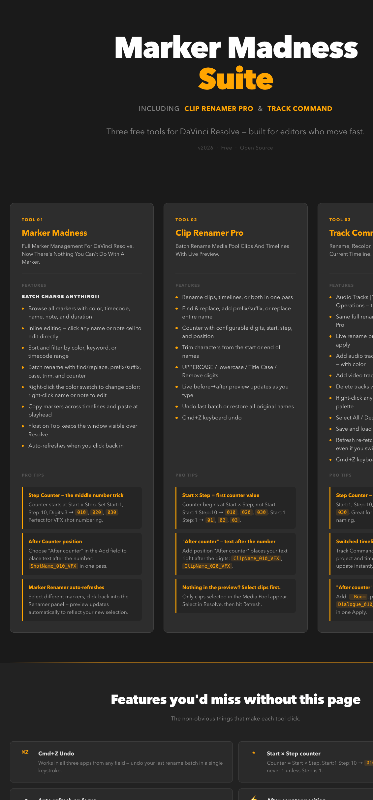

[README.md](https://github.com/user-attachments/files/27974206/README.md)

# Marker Madness Suite

Three free scripting tools for DaVinci Resolve — built for editors who move fast.

**Includes:** Marker Madness &nbsp;·&nbsp; Clip Renamer Pro &nbsp;·&nbsp; Track Command

---

## Installation

1. Download the three `.py` files from this repo
2. Copy them to your DaVinci Resolve scripts folder:
   - **macOS:** `/Library/Application Support/Blackmagic Design/DaVinci Resolve/Fusion/Scripts/Utility/`
   - **Windows:** `C:\ProgramData\Blackmagic Design\DaVinci Resolve\Support\Developer\Scripting\Scripts\Utility\`
3. Launch DaVinci Resolve
4. Run any tool from **Workspace → Scripts → Utility**

---

## The Tools

### Marker Madness
Full marker management for DaVinci Resolve. Browse, edit, filter, batch rename, recolor, and copy markers across timelines — all from one window.

### Clip Renamer Pro
Batch rename Media Pool clips and timelines with a live before/after preview. Find & replace, counters, case conversion, trim, prefix/suffix — all in one pass.

### Track Command
Rename and manage audio and video tracks in the current timeline. Batch rename with the full rename engine, add or delete tracks, search by name, and save/load track name sets as reusable templates.

---

## Documentation

Full feature guide and pro tips: [Marker Madness Suite — Manual.html](Marker%20Madness%20Suite%20%E2%80%94%20Manual.html)

---

*Free to use and share. Built with love for editors.*
